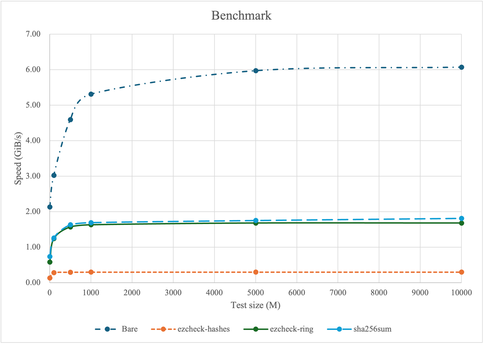

# ezcheck

[](https://github.com/Metaphorme/ezcheck/actions/workflows/build.yml)
[](https://github.com/Metaphorme/ezcheck/actions/workflows/test.yml)
[](https://crates.io/crates/ezcheck)

ezcheck(easy check) is an ergonomic, standard-output command-line tool for calculating, comparing, and verifying the
hash of strings and files.

ezcheck have two backends: [ring](https://docs.rs/ring), [hashes](https://docs.rs/hashes) and mix
backend([ring](https://docs.rs/ring) and [hashes](https://docs.rs/hashes)), and you can only choose
one of them. The main differences between them are:

| Features             | ring                                                       | hashes                                                          | mix                                                             |
|----------------------|------------------------------------------------------------|-----------------------------------------------------------------|-----------------------------------------------------------------|
| Speed                | Fast                                                       | About 5 times slower than ring.                                 | Use the fastest backend that supports the algorithm.            | 
| Supported algorithms | SHA256, SHA384, SHA512, SHA512/256                         | MD2, MD4, MD5, SHA1, SHA224, SHA256, SHA384, SHA512, SHA512/256 | MD2, MD4, MD5, SHA1, SHA224, SHA256, SHA384, SHA512, SHA512/256 |
| Implement languages  | Assembly, Rust, C and etc..                                | Rust                                                            | Assembly, Rust, C and etc..                                     |
| Compatibility        | May not work on every machine with different architecture. | Works well with Rust.                                           | Same to ring.                                                   |

❗️ To achieve both fastest speed and maximum compatibility, the default backend is **mix backend**.

⚠️ Please notice that although ezcheck supports a lot of hash algorithms, `MD2`, `MD4`, `MD5`, `SHA1` are proven to be
**insecure**. ezcheck still provides them for maximum compatibility, but **it does not recommend users continue to use
them**.

## Setup

### Install from binary

Download suitable binary from [Release](https://github.com/Metaphorme/ezcheck/releases/latest).

### Install from Cargo

```bash
$ # mix backend
$ cargo install ezcheck
$ # ring backend
$ cargo install ezcheck --no-default-features --features ring_backend
$ # hashes backend
$ cargo install ezcheck --no-default-features --features hashes_backend
```

### Build from source

#### Requirements

* [Rust 1.71.0+](https://github.com/Metaphorme/ezcheck/blob/master/Cargo.toml#L13)

#### Build

```bash
$ git clone https://github.com/Metaphorme/ezcheck && cd ezcheck
$ # Choose one from mix backend, hashes backend or ring backend
$ # mix backend
$ cargo build --release
$ # ring backend
$ cargo build --release --no-default-features --features ring_backend
$ # hashes backend
$ cargo build --release --no-default-features --features hashes_backend
$
$ ./target/release/ezcheck --version
```

## Run tests

```bash
$ git clone https://github.com/Metaphorme/ezcheck && cd ezcheck
$ cargo test  # mix backend
$ cargo test --no-default-features --features ring_backend    # ring backend
$ cargo test --no-default-features --features hashes_backend  # hashes backend
```

## Usage

Supported hash algorithms of different backends:

| ring       | hashes     | mix                       |
|------------|------------|---------------------------|
|            | MD2        | MD2 (hashes backend)      |
|            | MD4        | MD4 (hashes backend)      |
|            | MD5        | MD5 (hashes backend)      |
|            | SHA1       | SHA1 (hashes backend)     |
|            | SHA224     | SHA224 (hashes backend)   |
| SHA256     | SHA256     | SHA256 (ring backend)     |
| SHA384     | SHA384     | SHA384 (ring backend)     |
| SHA512     | SHA512     | SHA512 (ring backend)     |
| SHA512/256 | SHA512/256 | SHA512/256 (ring backend) |

### Calculate

Calculate hash for a file or text.

```bash
Usage:
    ezcheck calculate [ALGORITHM (Default SHA256)] (-f file(s)/"-" for standard input | -t text)

Examples:
$ ezcheck calculate sha256 -f image.jpg
4c03795a6bca220a68eae7c4f136d6247d58671e074bccd58a3b9989da55f56f  image.jpg
$
$ cat image.jpg | ezcheck calculate sha256 -f -
4c03795a6bca220a68eae7c4f136d6247d58671e074bccd58a3b9989da55f56f  -
$
$ ezcheck calculate sha256 -t "Hello"
SHA256:  185f8db32271fe25f561a6fc938b2e264306ec304eda518007d1764826381969
$
$ ezcheck calculate -f image.jpg
No algorithm specified. Using SHA256 as the default.
4c03795a6bca220a68eae7c4f136d6247d58671e074bccd58a3b9989da55f56f  image.jpg
$
$ # We could also redirect the output into a file, just like shasum does.
$ ezcheck calculate sha256 -f image.jpg > sha256sum.txt
```

### Compare

Compare with given hash.

```bash
Usage:
  ezcheck compare [ALGORITHM (Leave blank to automatically detect algorithm)] (-f file/"-" for standard input | -t text) -c hash
  
Examples:
$ ezcheck compare sha256 -f image.jpg -c 4c03795a6bca220a68eae7c4f136d6247d58671e074bccd58a3b9989da55f56f
SHA256 OK
$
$ cat image.jpg | ezcheck compare sha256 -f - -c 4c03795a6bca220a68eae7c4f136d6247d58671e074bccd58a3b9989da55f56f                           
SHA256 OK
$
$ ezcheck compare sha256 -t "Hello" -c 085f8db32271fe25f561a6fc938b2e264306ec304eda518007d1764826381969
SHA256 FAILED  Current Hash:  185f8db32271fe25f561a6fc938b2e264306ec304eda518007d1764826381969
$
$ # Auto detect hash algorithm
$ ezcheck compare -f image.jpg -c bebc102992450c68e5543383889e27c9
INFO: Hash Algorithm could be MD5, MD4, MD2
MD5 FAILED  Current Hash:  cb74bb502cc0949aad5cd838f91f0623
MD4 OK
```

### Check

Check with given shasum file.

shasum file could be generated from [shasum](https://linux.die.net/man/1/shasum) and ezcheck. It looks like:

```
00691413c731ee37f551bfaca6a34b8443b3e85d7c0816a6fe90aa8fc8eaec95  滕王阁序.txt
4c03795a6bca220a68eae7c4f136d6247d58671e074bccd58a3b9989da55f56f *image.jpg
```

```bash
Usage:
  ezcheck check [ALGORITHM (Leave blank to automatically detect algorithm)] -c check-file

Warning: The shasum file (or check file) should be in the same directory with files to be checked.
  
Example:
$ ezcheck check sha256 -c sha256sum.txt 
滕王阁序.txt: SHA256 OK
image.jpg: SHA256 OK
$
$ # Auto detect hash algorithm
$ cat sha256sum.txt
9ec44ac67ab1e1c98fe0406478d5297d  滕王阁序.txt
bebc102992450c68e5543383889e27c9  image.jpg
$ ezcheck check -c sha256sum.txt 
滕王阁序.txt: MD5 FAILED  Current Hash:  07c4e6a2c2db5f2d3a8998a3dba84a96
滕王阁序.txt: MD4 OK
image.jpg: MD5 FAILED  Current Hash:  cb74bb502cc0949aad5cd838f91f0623
image.jpg: MD4 OK
$
$ # Actually, ezcheck supports various algorithm in the same check file in auto detect.
$ # 🤔 But why this happens?
$ cat sha256sum.txt
00691413c731ee37f551bfaca6a34b8443b3e85d7c0816a6fe90aa8fc8eaec95  滕王阁序.txt
4c03795a6bca220a68eae7c4f136d6247d58671e074bccd58a3b9989da55f56f *image.jpg
9ec44ac67ab1e1c98fe0406478d5297d  滕王阁序.txt
$
$ ezcheck check -c sha256sum.txt
滕王阁序.txt: SHA256 OK
image.jpg: SHA256 OK
滕王阁序.txt: MD5 FAILED  Current Hash:  07c4e6a2c2db5f2d3a8998a3dba84a96
滕王阁序.txt: MD4 OK
```

## Benchmark

### Method

* Device: MacBook Air M1 8GB

* Steps:

1. Run and repeat 3 times:
    ```bash
    $ count=10000  # Test size = 1MiB * $count
    $ # Bare
    $ dd if=/dev/zero bs=1M count=$count | pv > /dev/null
    $ # ezcheck-hashes
    $ dd if=/dev/zero bs=1M count=$count | pv | ./ezcheck-hashes calculate sha256 -f -
    $ # ezcheck-ring
    $ dd if=/dev/zero bs=1M count=$count | pv | ./ezcheck-ring calculate sha256 -f -
    $ # sha256sum
    $ dd if=/dev/zero bs=1M count=$count | pv | sha256sum
    ```

2. Calculate the average value.

### Result

| Command/Speed(GiB/s)/Test size(MiB) | 1    | 100  | 500  | 1000 | 5000 | 10000 |
|-------------------------------------|------|------|------|------|------|-------|
| Bare                                | 2.13 | 3.02 | 4.59 | 5.31 | 5.97 | 6.07  |
| ezcheck-hashes                      | 0.13 | 0.28 | 0.29 | 0.30 | 0.30 | 0.30  |
| ezcheck-ring                        | 0.58 | 1.24 | 1.57 | 1.63 | 1.68 | 1.68  |
| sha256sum                           | 0.73 | 1.26 | 1.63 | 1.69 | 1.75 | 1.81  |



## License

```
MIT License

Copyright (c) 2024 Heqi Liu

Permission is hereby granted, free of charge, to any person obtaining a copy
of this software and associated documentation files (the "Software"), to deal
in the Software without restriction, including without limitation the rights
to use, copy, modify, merge, publish, distribute, sublicense, and/or sell
copies of the Software, and to permit persons to whom the Software is
furnished to do so, subject to the following conditions:

The above copyright notice and this permission notice shall be included in all
copies or substantial portions of the Software.

THE SOFTWARE IS PROVIDED "AS IS", WITHOUT WARRANTY OF ANY KIND, EXPRESS OR
IMPLIED, INCLUDING BUT NOT LIMITED TO THE WARRANTIES OF MERCHANTABILITY,
FITNESS FOR A PARTICULAR PURPOSE AND NONINFRINGEMENT. IN NO EVENT SHALL THE
AUTHORS OR COPYRIGHT HOLDERS BE LIABLE FOR ANY CLAIM, DAMAGES OR OTHER
LIABILITY, WHETHER IN AN ACTION OF CONTRACT, TORT OR OTHERWISE, ARISING FROM,
OUT OF OR IN CONNECTION WITH THE SOFTWARE OR THE USE OR OTHER DEALINGS IN THE
SOFTWARE.
```
