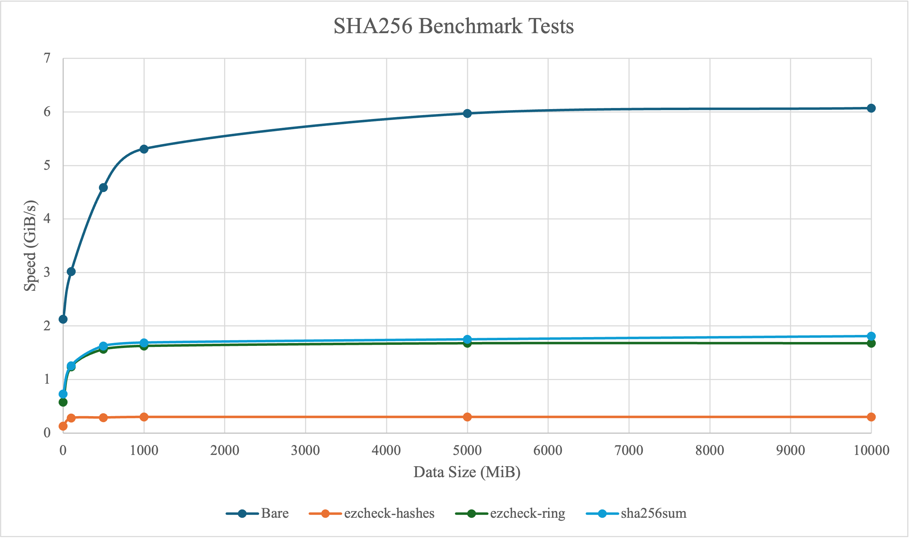
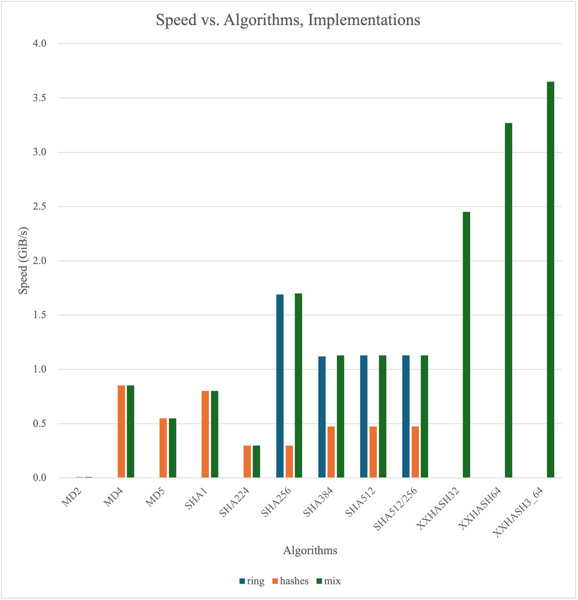

# ezcheck

[](https://github.com/Metaphorme/ezcheck/actions/workflows/build.yml)
[](https://github.com/Metaphorme/ezcheck/actions/workflows/test.yml)
[](https://crates.io/crates/ezcheck)
[](https://gitee.com/metaphorme/ezcheck)

ezcheck（或 easy check）是一个轻量、高性能、跨平台、易于使用的用于计算、对比和验证字符串或文件哈希值的工具，用于防止内容篡改和确保文件的完整性。

ezcheck 有三个后端：[ring](https://docs.rs/ring)，[hashes](https://docs.rs/hashes)
和混合后端（mix backend，同时使用[ring](https://docs.rs/ring)，[hashes](https://docs.rs/hashes)），并且您只能选择其中一个。这些后端的主要差异在于：

| 特点    | ring                               | hashes                                                          | mix（混合后端，推荐使用）                                                                         |
|-------|------------------------------------|-----------------------------------------------------------------|----------------------------------------------------------------------------------------|
| 速度    | 非常快。                               | 大约比 ring 慢五倍。                                                   | 使用支持此算法的最快后端。                                                                          | 
| 支持的算法 | SHA256, SHA384, SHA512, SHA512/256 | MD2, MD4, MD5, SHA1, SHA224, SHA256, SHA384, SHA512, SHA512/256 | MD2, MD4, MD5, SHA1, SHA224, SHA256, SHA384, SHA512, SHA512/256, XXH32, XXH64, XXH3_64 |
| 实现语言  | Assembly, Rust, C 等。               | Rust                                                            | Assembly, Rust, C 等。                                                                   |
| 兼容性   | 可能无法在一些系统和架构上工作。                   | 和 Rust 兼容性一致。                                                   | 与 ring 相同。                                                                             |

❗️ 为了兼顾最快的速度和最大的算法兼容性，默认后端是混合后端（mix backend）。

⚠️ 请注意，虽然 ezcheck 支持很多哈希算法，但是`MD2`，`MD4`，`MD5`，`SHA1`已被证明**不安全**。ezcheck
仍然提供它们以实现最大的算法兼容性，但并不建议用户继续使用它们。

## 安装方法

### 从二进制文件安装

从 [release](https://github.com/Metaphorme/ezcheck/releases/latest) 下载适合的二进制版本。

### 从 Cargo 安装

```bash
$ # mix backend
$ cargo install ezcheck
$ # ring backend
$ cargo install ezcheck --no-default-features --features ring_backend
$ # hashes backend
$ cargo install ezcheck --no-default-features --features hashes_backend
```

### 使用 x-cmd 即刻运行 ezcheck

[x-cmd](https://x-cmd.com) 是一个在 POSIX Shell 实现的轻量级、跨平台包管理工具。
仅需运行[`x ezcheck`](https://x-cmd.com/pkg/ezcheck)即可快速下载并运行 ezcheck。

您还可以在用户级别安装 ezcheck，而无需使用 root 权限：

```bash
$ x env use ezcheck
```

### 从源码编译

[](./Cargo.toml#L11)

#### 构建

```bash
$ git clone https://github.com/Metaphorme/ezcheck && cd ezcheck
$ # 可从 mix backend、hashes backend、ring backend 中任选其一
$ # mix backend
$ cargo build --release
$ # ring backend
$ cargo build --release --no-default-features --features ring_backend
$ # hashes backend
$ cargo build --release --no-default-features --features hashes_backend
$
$ ./target/release/ezcheck --version
```

## 运行测试

```bash
$ git clone https://github.com/Metaphorme/ezcheck && cd ezcheck
$ cargo test  # mix backend
$ cargo test --no-default-features --features ring_backend    # ring backend
$ cargo test --no-default-features --features hashes_backend  # hashes backend
```

## 用法

不同后端支持的哈希算法：

| ring       | hashes     | mix                  |
|------------|------------|----------------------|
|            | MD2        | MD2 (hashes 后端)      |
|            | MD4        | MD4 (hashes 后端)      |
|            | MD5        | MD5 (hashes 后端)      |
|            | SHA1       | SHA1 (hashes 后端)     |
|            | SHA224     | SHA224 (hashes 后端)   |
| SHA256     | SHA256     | SHA256 (ring 后端)     |
| SHA384     | SHA384     | SHA384 (ring 后端)     |
| SHA512     | SHA512     | SHA512 (ring 后端)     |
| SHA512/256 | SHA512/256 | SHA512/256 (ring 后端) |
|            |            | XXH32                |
|            |            | XXH64                |
|            |            | XXH3_64              |

### 计算

计算文件或文本的哈希。

```bash
$ # 用法：
$ #  ezcheck calculate|c [算法 (默认：SHA256)] (-f 文件/"-"则从标准输入读取 | -t 文本)
$
$ # 例子：
$ ezcheck c sha256 -f image.jpg
4c03795a6bca220a68eae7c4f136d6247d58671e074bccd58a3b9989da55f56f  image.jpg
$
$ cat image.jpg | ezcheck calculate sha256 -f -
4c03795a6bca220a68eae7c4f136d6247d58671e074bccd58a3b9989da55f56f  -
$
$ ezcheck calculate sha256 -t "Hello"
SHA256:  185f8db32271fe25f561a6fc938b2e264306ec304eda518007d1764826381969
$
$ ezcheck calculate -f image.jpg
No algorithm specified. Using SHA256 as the default.
4c03795a6bca220a68eae7c4f136d6247d58671e074bccd58a3b9989da55f56f  image.jpg
$
$ # 我们也可以将输出重定向到文件中，正如 shasum 所做的那样。
$ ezcheck calculate sha256 -f image.jpg > sha256sum.txt
```

### 对比

与给定的哈希比较。

```bash
$ # 用法：
$ #  ezcheck compare|m [算法 (留空则自动检测算法)] (-f 文件/"-"则从标准输入读取 | -t 文本) -c 需要对比的哈希
$  
$ # 例子：
$ ezcheck m sha256 -f image.jpg -c 4c03795a6bca220a68eae7c4f136d6247d58671e074bccd58a3b9989da55f56f
SHA256 OK
$
$ cat image.jpg | ezcheck compare sha256 -f - -c 4c03795a6bca220a68eae7c4f136d6247d58671e074bccd58a3b9989da55f56f                           
SHA256 OK
$
$ ezcheck compare sha256 -t "Hello" -c 085f8db32271fe25f561a6fc938b2e264306ec304eda518007d1764826381969
SHA256 FAILED  Current Hash:  185f8db32271fe25f561a6fc938b2e264306ec304eda518007d1764826381969
$
$ # 自动检测算法
$ ezcheck compare -f image.jpg -c bebc102992450c68e5543383889e27c9
INFO: Hash Algorithm could be MD5, MD4, MD2
MD5 FAILED  Current Hash:  cb74bb502cc0949aad5cd838f91f0623
MD4 OK
```

### 验证

与给定的 shasum 样式的验证文件对比。

shasum 样式的验证文件可以由 [shasum](https://linux.die.net/man/1/shasum)
或 [ezcheck](https://github.com/Metaphorme/ezcheck) 生成，它的形式是这样的：

```
00691413c731ee37f551bfaca6a34b8443b3e85d7c0816a6fe90aa8fc8eaec95  滕王阁序.txt
4c03795a6bca220a68eae7c4f136d6247d58671e074bccd58a3b9989da55f56f *image.jpg
```

```bash
$ # 用法：
$ #  ezcheck check|k [算法 (留空则自动检测算法)] -c 验证文件
$
$ # 警告：验证文件应当与需要检查的文件在同一目录。
$ # 例子：
$ ezcheck k sha256 -c sha256sum.txt 
滕王阁序.txt: SHA256 OK
image.jpg: SHA256 OK
$
$ # 自动检测哈希算法
$ cat sha256sum.txt
9ec44ac67ab1e1c98fe0406478d5297d  滕王阁序.txt
bebc102992450c68e5543383889e27c9  image.jpg
$ ezcheck check -c sha256sum.txt 
滕王阁序.txt: MD5 FAILED  Current Hash:  07c4e6a2c2db5f2d3a8998a3dba84a96
滕王阁序.txt: MD4 OK
image.jpg: MD5 FAILED  Current Hash:  cb74bb502cc0949aad5cd838f91f0623
image.jpg: MD4 OK
$
$ # 实际上，ezcheck 的自动检测模式支持在同一验证文件中使用不同的算法。
$ # 🤔 但这种事为什么会发生呢？
$ cat sha256sum.txt
00691413c731ee37f551bfaca6a34b8443b3e85d7c0816a6fe90aa8fc8eaec95  滕王阁序.txt
4c03795a6bca220a68eae7c4f136d6247d58671e074bccd58a3b9989da55f56f *image.jpg
9ec44ac67ab1e1c98fe0406478d5297d  滕王阁序.txt
$
$ ezcheck check -c sha256sum.txt
滕王阁序.txt: SHA256 OK
image.jpg: SHA256 OK
滕王阁序.txt: MD5 FAILED  Current Hash:  07c4e6a2c2db5f2d3a8998a3dba84a96
滕王阁序.txt: MD4 OK
```

## 基准测试

### SHA256 基准测试

#### 实验方法

* 设备：MacBook Air M1 8GB

* 步骤

    1. 运行并重复 3 次：
        ```bash
        $ count=10000  # Test size = 1MiB * $count
        $ # Bare, Speed of generating the data
        $ dd if=/dev/zero bs=1M count=$count | pv > /dev/null
        $ # ezcheck-hashes
        $ dd if=/dev/zero bs=1M count=$count | pv | ./ezcheck-hashes calculate sha256 -f -
        $ # ezcheck-ring
        $ dd if=/dev/zero bs=1M count=$count | pv | ./ezcheck-ring calculate sha256 -f -
        $ # sha256sum
        $ dd if=/dev/zero bs=1M count=$count | pv | sha256sum
        ```

    2. 计算平均值。

#### 实验结果

| 实现 / 速度(GiB/s) / 数据量(MiB) | 1    | 100  | 500  | 1000 | 5000 | 10000 |
|---------------------------|------|------|------|------|------|-------|
| Bare（数据生成速度）              | 2.13 | 3.02 | 4.59 | 5.31 | 5.97 | 6.07  |
| ezcheck-hashes            | 0.13 | 0.28 | 0.29 | 0.30 | 0.30 | 0.30  |
| ezcheck-ring              | 0.58 | 1.24 | 1.57 | 1.63 | 1.68 | 1.68  |
| sha256sum                 | 0.73 | 1.26 | 1.63 | 1.69 | 1.75 | 1.81  |



### 速度 vs. 算法，实现

#### 实验方法

* 设备：MacBook Air M1 8GB

* 步骤

    1. 执行：
        ```bash
        $ algorithm=sha256
        $ # ezcheck-hashes
        $ dd if=/dev/zero bs=1M count=10000 | pv | ./ezcheck-hashes calculate $algorithm -f -
        $ # ezcheck-ring
        $ dd if=/dev/zero bs=1M count=10000 | pv | ./ezcheck-ring calculate $algorithm -f -
        $ # ezcheck-mix
        $ dd if=/dev/zero bs=1M count=10000 | pv | ./ezcheck-mix calculate $algorithm -f -
        ```
    2. 计算平均值

#### 实验结果

| 算法 / 速度(GiB/s) / 实现 | ring   | hashes   | mix      |
|---------------------|--------|----------|----------|
| MD2                 | 	null* | 	0.00896 | 	0.00896 |
| MD4                 | 	null* | 	0.852   | 	0.852   |               
| MD5                 | 	null* | 	0.549   | 	0.549   |                     
| SHA1                | 	null* | 	0.802   | 	0.802   |                      
| SHA224	             | null*  | 	0.299   | 	0.299   |                  
| SHA256              | 	1.69	 | 0.298    | 	1.70    |                   
| SHA384              | 	1.12	 | 0.473    | 	1.13    |                   
| SHA512	             | 1.13	  | 0.473    | 	1.13    |                   
| SHA512/256          | 	1.13	 | 0.473    | 	1.13    |               
| XXHASH32	           | null*	 | null*	   | 2.45     |               
| XXHASH64	           | null*	 | null*	   | 3.27     |               
| XXHASH3_64	         | null*  | 	null*   | 	3.65    |    

_null*: 此实现并未实现此算法。_



## 许可证

```
MIT License

Copyright (c) 2024 Heqi Liu

Permission is hereby granted, free of charge, to any person obtaining a copy
of this software and associated documentation files (the "Software"), to deal
in the Software without restriction, including without limitation the rights
to use, copy, modify, merge, publish, distribute, sublicense, and/or sell
copies of the Software, and to permit persons to whom the Software is
furnished to do so, subject to the following conditions:

The above copyright notice and this permission notice shall be included in all
copies or substantial portions of the Software.

THE SOFTWARE IS PROVIDED "AS IS", WITHOUT WARRANTY OF ANY KIND, EXPRESS OR
IMPLIED, INCLUDING BUT NOT LIMITED TO THE WARRANTIES OF MERCHANTABILITY,
FITNESS FOR A PARTICULAR PURPOSE AND NONINFRINGEMENT. IN NO EVENT SHALL THE
AUTHORS OR COPYRIGHT HOLDERS BE LIABLE FOR ANY CLAIM, DAMAGES OR OTHER
LIABILITY, WHETHER IN AN ACTION OF CONTRACT, TORT OR OTHERWISE, ARISING FROM,
OUT OF OR IN CONNECTION WITH THE SOFTWARE OR THE USE OR OTHER DEALINGS IN THE
SOFTWARE.
```
